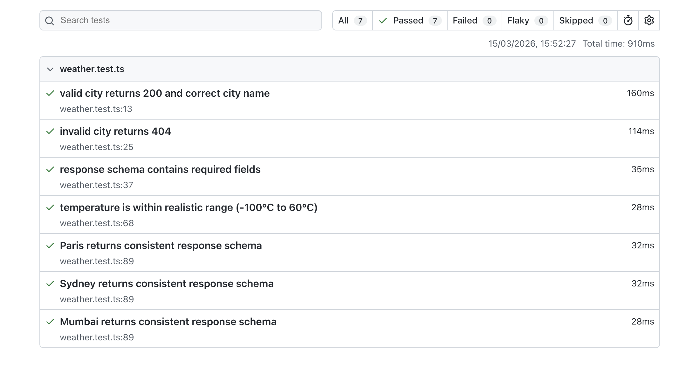

# OpenWeatherMap API — Playwright E2E Test Suite


A focused Playwright test suite validating the [OpenWeatherMap Current Weather API](https://openweathermap.org/current). Covers happy path responses, error handling, schema validation, data quality checks, and cross-city consistency.

## What's Tested

| # | Test | What it validates |
|---|------|-------------------|
| 1 | Valid city returns 200 | Happy path — correct status and city name |
| 2 | Invalid city returns 404 | Error handling — bad input returns correct error |
| 3 | Response schema validation | All required fields present and correctly typed |
| 4 | Temperature range check | Data quality — temp is within realistic bounds |
| 5 | Multi-city schema consistency | Parameterized — Paris, Sydney, Mumbai all return consistent shape |

## Setup

```bash
npm install
npx playwright install
```

Set your API key as an environment variable:
```bash
export OPENWEATHER_API_KEY=your_api_key_here
```

Or create a `.env` file (never commit this):
```
OPENWEATHER_API_KEY=your_api_key_here
```

Get a free key at [openweathermap.org](https://openweathermap.org/api).

## CI/CD

Tests run automatically on every push and pull request via GitHub Actions.

To enable CI, add your API key as a GitHub secret:
1. Go to your repo → **Settings** → **Secrets and variables** → **Actions**
2. Click **New repository secret**
3. Name: `OPENWEATHER_API_KEY`, Value: your API key

## Run Tests

```bash
npx playwright test
```

## Tech Stack

- [Playwright](https://playwright.dev/) — test framework
- TypeScript
- OpenWeatherMap API (free tier)

## Test Results


7/7 tests passing — 910ms total run time.

## Why These Tests?

This suite mirrors the kinds of checks that matter in production API testing:
- **Contract validation** — does the response shape match what consumers expect?
- **Error handling** — does the API fail gracefully?
- **Data quality** — are values within expected bounds?
- **Consistency** — does behavior hold across different inputs?